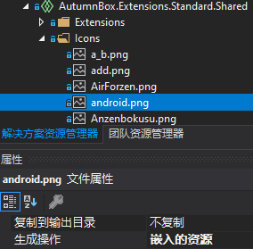

## 开始
在前面的章节中，我们大概了解到秋之盒模块的名字应当`class`上的`特性(Attribute)`来声明模块的元信息(Metadata)：
```java
[ExtName("Hello world!")]
class EHelloAutumnBox : LeafExtensionBase{
    //.....
}
```
在运行时，秋之盒会通过`反射`技术获取拓展模块特性中的元信息。    

## 先导知识: I18N
在开始学习更多知识前，首先了解一下秋之盒中常见的多语言化方法，例如：
```java
ExtName("Happy","zh-cn:开心","zh-tw:開心")
```
上面的代码中表明了：秋之盒使用简体中文语言时，该拓展模块名为`开心`，台湾繁体中文时为`開心`，如果不是以上两种语言，则使用首个参数作为默认值：`Happy`。    
当然，你可以可以选择不使用这个玩法：
```java
//无论如何,都只会是"你好"
[ExtName("你好")]
```

## 主要的特性
秋之盒SDK还提供了许多预置特性以及一些新的可拓展逻辑供你更好地个性化模块信息。
:::tip
* 主要的特性均位于源码中的[此目录中(在Github浏览)](https://github.com/zsh2401/AutumnBox/tree/master/src/AutumnBox.OpenFramework.Shared/Extension/Attribute)。命名空间是`AutumnBox.OpenFramework.Extension`。
* [EmptyExtension](https://github.com/zsh2401/AutumnBox/blob/master/src/AutumnBox.OpenFramework.Shared/Extension/EmptyExtension.cs)包含了默认的特性，建议拓展模块可以继承于其。
:::
### ExtName
支持`I18N`，接收`String`类型的变长参数，用于表达拓展模块的人类可读名字。
```java
[ExtName("Example Extension","zh-cn:示例拓展模块")]
```
### ExtRequiredDeviceStates
接收[DeviceState](https://github.com/zsh2401/AutumnBox/blob/master/src/AutumnBox.Basic.Shared/Device/DeviceState.cs)作为参数，用于表明拓展模块运行所必须的设备状态，秋之盒将确保模块不会在设备不满足条件的情况下被用户启动。   
```java
[ExtRequiredDeviceStates(DeviceState.Poweron)]
```
:::tip 扩展用法
* 如果想要表明拓展模块运行与设备状态无关(甚至是没有插入设备)，请传入[AutumnBoxExtension.NoMatter](https://github.com/zsh2401/AutumnBox/blob/master/src/AutumnBox.OpenFramework.Shared/Extension/AutumnBoxExtension.Constants.cs)。如果不插入设备不可以的话，则请传入该类中的`AllState`常量。
* 想要支持多个状态，可以使用`或`运算符。(可以观察到[DeviceState](https://github.com/zsh2401/AutumnBox/blob/master/src/AutumnBox.Basic.Shared/Device/DeviceState.cs)中的值支持这样的操作)
```java
[ExtRequiredDeviceStates(DeviceState.Poweron | DeviceState.Recovery)]
```
:::
### [ExtAuth](https://github.com/zsh2401/AutumnBox/blob/master/src/AutumnBox.OpenFramework.Shared/Extension/Attribute/ExtAuthAttribute.cs)
支持`I18N`，传入一个变长String以表示拓展模块所有者信息。
```java
[ExtAuth("Seymour Zhang","zh-cn:张三"]
```
### [ExtDesc](https://github.com/zsh2401/AutumnBox/blob/master/src/AutumnBox.OpenFramework.Shared/Extension/Attribute/ExtDescAttribute.cs)
支持`I18N`，传入一个变长String以表示拓展模块的简单解释信息。
```java
[ExtDesc("此模块与地球三体组织无关","en-us:This extension have nothing to do with ETO")]
```
### [ExtDeveloperMode](https://github.com/zsh2401/AutumnBox/blob/master/src/AutumnBox.OpenFramework.Shared/Extension/Attribute/ExtDeveloperMode.cs)
传入布尔值表示该模块是否开启开发者模式。如果是,则该拓展模块只会在秋之盒设置中开启`调试模式`后才会显示。
```java
[ExtDeveloperMode] //Default value is true
```
### [ExtHidden](https://github.com/zsh2401/AutumnBox/blob/master/src/AutumnBox.OpenFramework.Shared/Extension/Attribute/ExtHiddenAttribute.cs)
传入布尔值表示该模块是否被隐藏。如果隐藏，则用户将无法直接启动该模块，即便开启调试模式。
```java
[ExtHidden] //Default value is true
```
### [ExtIcon](https://github.com/zsh2401/AutumnBox/blob/master/src/AutumnBox.OpenFramework.Shared/Extension/Attribute/ExtIconAttribute.cs)
表示一个拓展模块的图标。目前提供两种方式。   
**第一种方式**，嵌入资源：直接传入图标的在项目中的绝对路径即可。 
例如：使用这个位置的图标的代码是：

```java
[ExtIcon("Icons.android.png")]
```

:::warning
图标文件一定要调整为"嵌入的资源"
:::
**第二种方式**,base64字符串。声明你的方式，并将图标的base64字符串传入。
```java
[ExtIcon("THE BASE64 STRING OF THE ICON",SourceType =ExtIconAttribute.IconSourceType.Base64Image)]
```
### [ExtRequireRoot](https://github.com/zsh2401/AutumnBox/blob/master/src/AutumnBox.OpenFramework.Shared/Extension/Attribute/ExtRequireRootAttribute.cs)
传入布尔值，表明此模块需要设备获取ROOT才能够运行。秋之盒也会在显眼的位置标明该模块需要ROOT权限。
:::danger
考虑到ROOT检测的复杂情况，秋之盒不会阻止可能没有ROOT的设备执行拓展模块，如有需要，请开发者另行测试，或[贡献相关代码](https://github.com/zsh2401/AutumnBox/blob/master/src/AutumnBox.Basic.Shared/Device/DeviceExtension.Management.cs)。
:::
### [ExtRegions](https://github.com/zsh2401/AutumnBox/blob/master/src/AutumnBox.OpenFramework.Shared/Extension/Attribute/ExtRegionsAttribute.cs)
传入String类型变长参数，表明一个可运行语言地区白名单。
```java
[ExtRegions("zh-cn","zh-tw","en-us")]
```
:::tip
不挂此特性则默认无地区限制。
:::
### [ExtVersion](https://github.com/zsh2401/AutumnBox/blob/master/src/AutumnBox.OpenFramework.Shared/Extension/Attribute/ExtVersionAttribute.cs)
传入一个至三个整型数字，表明拓展模块的版本信息。
```java
[ExtVersion(2,1,9)]
//[ExtVersion(1,1)]
//[ExtVersion(2)]
```
### [ExtRunnablePolicy](https://github.com/zsh2401/AutumnBox/blob/master/src/AutumnBox.OpenFramework.Shared/Extension/Attribute/ExtRunnablePolicyAttribute.cs)
一个抽象类，开发者可继承并实现该抽象类以创建自定义的运行检测策略，用于限制模块可否被用户运行。    
:::tip 
事实上，继承自[EmptyExtension](https://github.com/zsh2401/AutumnBox/blob/master/src/AutumnBox.OpenFramework.Shared/Extension/EmptyExtension.cs)的拓展模块默认包含了一个基础的运行检测策略：[ExtNormalRunnablePolicy](https://github.com/zsh2401/AutumnBox/blob/master/src/AutumnBox.OpenFramework.Shared/Extension/Attribute/ExtNormalRunnablePolicyAttribute.cs)，这个默认策略确保了拓展模块只会在设备状态正确时被启动。
:::

此外，还有一些策略由于各种原因，暂且不在此处进行介绍，如果需要请阅读[相关源码](https://github.com/zsh2401/AutumnBox/tree/master/src/AutumnBox.OpenFramework.Shared/Extension/Attribute)注释。

## 获取拓展模块本身的信息
我们可以通过[LeafExtensionBase.GetExtensionInfo()](https://github.com/zsh2401/AutumnBox/blob/master/src/AutumnBox.OpenFramework.Shared/Extension/Leaf/LeafExtension.cs)方法获取到拓展模块所有元信息。
然后使用[ExtensionInfoExtension](https://github.com/zsh2401/AutumnBox/blob/master/src/AutumnBox.OpenFramework.Shared/Management/ExtInfo/ExtensionInfoExtension.cs)中提供了一系列拓展方法帮助我们获取更加特定的值。
```java
//...
[ExtName("Test","zh-cn:测试")]
class ETest{
    [LMain]
    void Main(){
        var extInf = this.GetExtensionInfo();
        var extName = extInf.Name(); //Test 或 测试 取决于具体的语言环境
        var reqState = extInf.RequiredDeviceState();
    }
}
//....
```

## 自定义的元信息
你可以继承自[ExtensionInfoAttribute](https://github.com/zsh2401/AutumnBox/blob/master/src/AutumnBox.OpenFramework.Shared/Extension/Attribute/ExtensionInfoAttribute.cs)或[ExtensionI18NTextInfoAttribute](https://github.com/zsh2401/AutumnBox/blob/master/src/AutumnBox.OpenFramework.Shared/Extension/Attribute/ExtensionI18NTextInfoAttribute.cs)实现你自己的元信息。
### 获取自定义的元信息
获取到ExtensionInfo后，获取对应键的值即可。
```java
//...
void Main(){
    var extInf = this.GetExtensionInfo();
    var value = extInf["CustomKey"]();//直接获取到的是`ValueReader`函数指针，需要再次执行才能获取到真正的值
}
//...
```
事实上，秋之盒开放框架里大部分内置的特性都是这个原理。

更多内容，请阅读[相关源码](https://github.com/zsh2401/AutumnBox/tree/master/src/AutumnBox.OpenFramework.Shared/Extension/Attribute)。