# 1.创建项目
## 1.1 创建新项目
打开`Visual Studio 2019`，点击右下角`创建新项目`
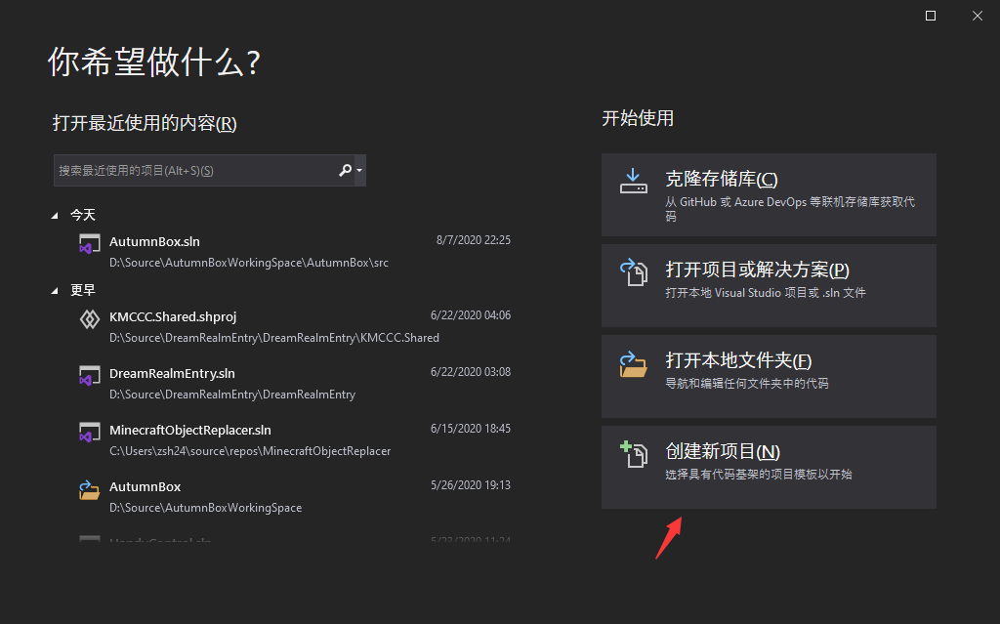
## 1.2 选择合适的目标
选择`.Net Core类库`
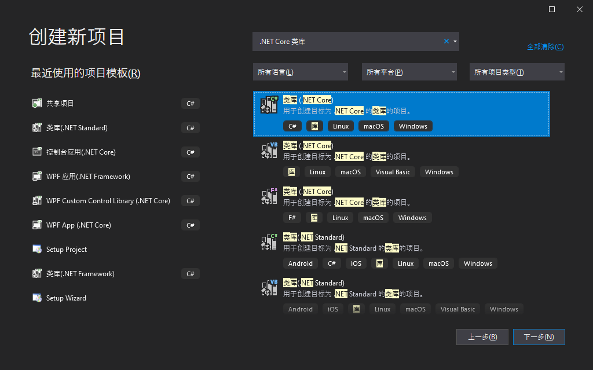
值得注意的是，如果您的拓展模块中需要编写`WPF`控件，请在这一步时选择`WPF Custom Control Library`或`WPF User Control Library`   
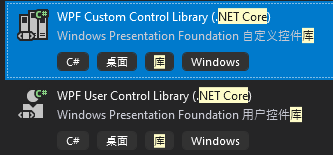

## 1.3 填写项目信息
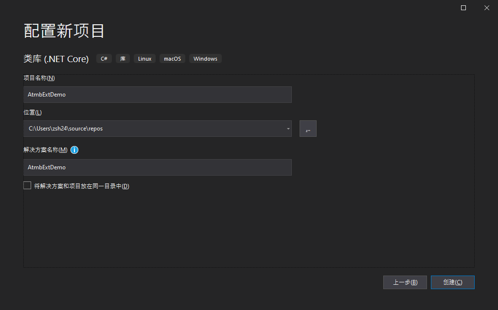

## 1.4 完成
此时,我们得到了一个不包含任何实际业务逻辑的空项目。
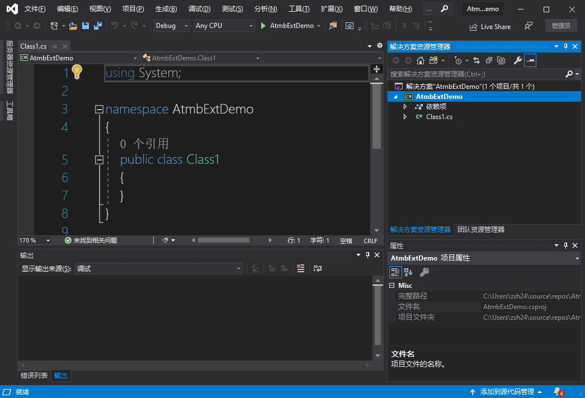
# 2.安装秋之盒SDK
## 2.1 打开Nuget管理界面
::: tip 什么是Nuget?
`NuGet`是.NET项目的一种包管理器，我们可以通过其在线安装与管理项目的依赖程序集。   
`NuGet`之于`C#`，就好像`npm`之于`JavaScript`，`Maven`之于`Java`，`PIP`之于`Python`,`apt`之于`Debian`
:::
右键项目，点击`管理NuGet程序包`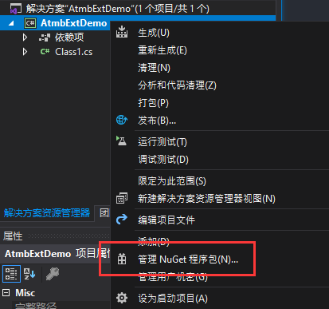
便可以打开NuGet包的管理界面了，我们可以在这里搜索，安装，更新，卸载`NuGet`包。

## 2.2 搜索并安装秋之盒SDK
在搜索框搜索`AutumnBox.SDK`即可找到秋之盒SDK。
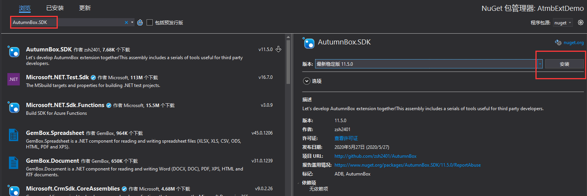
点击安装后，秋之盒SDK就会被以依赖的形式引入到你的项目中了。
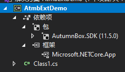

搜不到秋之盒SDK怎么办?
请在搜索时修改源为nuget   
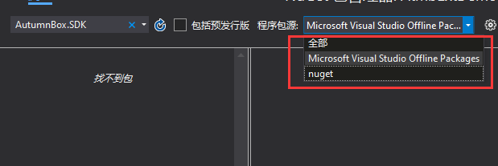

## 2.3 检查
在`Class1.cs`中编写一段简单的代码，这段代码调用了秋之盒SDK的中获取SDK版本的接口，没有任何错误提示。
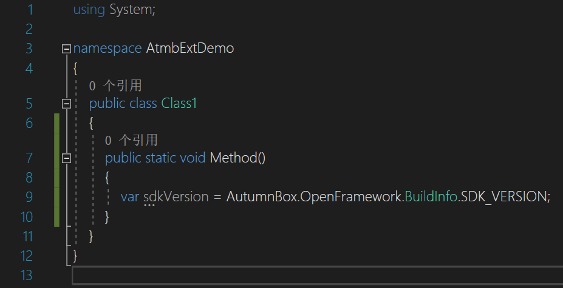
至此，秋之盒SDK安装完毕，请删除掉自动生成的无用`Class1.cs`。

# 3.第一个拓展模块
万事俱备，是时候创建自己的第一个秋之盒拓展模块了。
## 3.1 新建拓展模块类
新建一个名为`EHelloAutumnBox`，并且使其继承于`AutumnBox.OpenFramework.Extension.Leaf.LeafExtensionBase`
```Java
using AutumnBox.OpenFramework.Extension.Leaf;
namespace AtmbExtDemo
{
    class EHelloAutumnBox : LeafExtensionBase
    {
    }
}
```
## 3.2 添加主要方法
在类中加入一个主要方法，名称与修饰符随意，但需要挂上`LMain`特性。
```Java
using AutumnBox.OpenFramework.Extension.Leaf;
namespace AtmbExtDemo
{
    class EHelloAutumnBox : LeafExtensionBase
    {
        [LMain]
        public void Run(){
            //业务逻辑
        }
    }
}
```
## 3.3 编写逻辑
在刚刚创建的主要方法中，填入逻辑。这里，跟随我的步伐，写入以下内容：
```Java
using AutumnBox.OpenFramework.Extension;
using AutumnBox.OpenFramework.Extension.Leaf;
using AutumnBox.OpenFramework.Open;

namespace AtmbExtDemo
{
    [ExtName("Hello world!")]
    [ExtRequiredDeviceStates(AutumnBoxExtension.NoMatter)]
    class EHelloAutumnBox : LeafExtensionBase
    {
        [LMain]
        public void Run(IUx ux)
        {
            ux.Message("你好，秋之盒");
        }
    }
}
```
### 3.3.1 类上面是啥?
在秋之盒拓展模块的设计中，你的拓展模块信息通过特性(Attribute)来表达。`ExtName`表明了这个拓展模块的名字，`ExtRequiredDeviceStates`表明了这个拓展模块执行所需求的安卓设备状态，这里我们使用`AutumnBoxExtension.NoMatter`表示"管他设备有没有连接,管它设备什么状态,我这模块都能跑!"
### 3.3.2 主要方法多了个参数?
可以观察到，我们在主要方法的参数列表中加入了一个`AutumnBox.OpenFramework.Open.IUx`类型的参数，这表明我们向秋之盒请求了`IUx`编程接口，这个接口提供了一些系列最基础的用户交互方式。
当拓展模块被执行时，秋之盒将自动扫描主方法参数列表,并将请求的接口传入，这就是最基础的依赖注入。
### 3.3.3 主要方法的逻辑
之后，我们调用`IUx`接口提供的Message方法以向用户发送一条需要确认的信息。

## 3.4 构建
右键项目，点击生成。


如果没有语法错误的话，构建将是成功的，在构建输出中我们可以看到构建出来的类库文件在哪里。
```
1>------ 已启动生成: 项目: AtmbExtDemo, 配置: Debug Any CPU ------
1>AtmbExtDemo -> C:\Users\zsh24\source\repos\AtmbExtDemo\AtmbExtDemo\bin\Debug\netcoreapp3.1\AtmbExtDemo.dll
========== 生成: 成功 1 个，失败 0 个，最新 0 个，跳过 0 个 ==========
```

# 4.你好,秋之盒
## 4.1 安装模块
将构建出来的`.dll`文件放置到秋之盒程序目录下的`extensions`文件夹中。

## 4.2 大功告成
启动秋之盒，点击我们编写的模块即可运行。
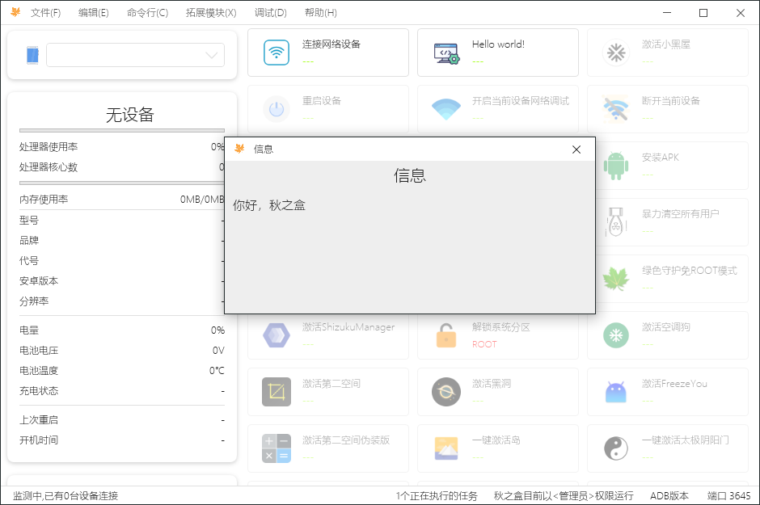
